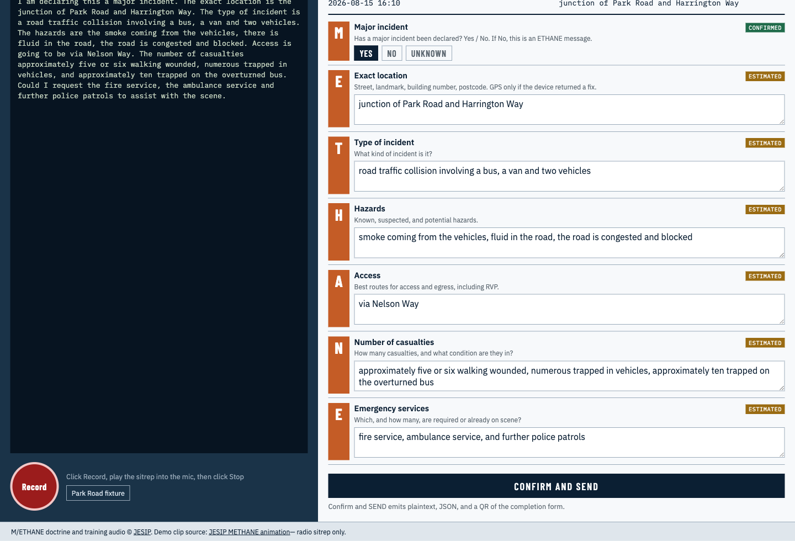

<div align="center">

# M/ETHANE

### Speak the scene. Check the official form. Send it — even with no signal.

A first officer on scene talks naturally. This app turns that speech into the seven boxes UK emergency services already use, then waits for the officer to confirm before anything goes out.

It does not replace the officer, the official JESIP app, or the control room.

[](LICENSE)
[](#privacy)

</div>



## Why this exists

When something serious happens, the first officer on scene has to get a shared picture to everyone else: where it is, what it is, what is dangerous, how to get in, how many people are hurt, and who is needed.

UK services already have a way to say that. It is called **M/ETHANE**. The problem is not the seven boxes. The problem is filling them while the scene is still unfolding — typing, or reciting letters in order, with gloved hands and a radio in the other.

This app is for the talking part. You speak. The form fills. You still decide what is true. The idea is coordination and honest information, not less paperwork.

## What is M/ETHANE?

[M/ETHANE](https://www.jesip.org.uk/joint-doctrine/m-ethane/) is the JESIP mnemonic for that first shared picture:

| | Box | In plain English |
|---|---|---|
| **M** | Major incident | Has a major incident been *declared*? Not “does this look big?” |
| **E** | Exact location | A place other services can actually find |
| **T** | Type of incident | What kind of incident it is |
| **H** | Hazards | What is dangerous, or might be |
| **A** | Access | Best way in and out |
| **N** | Number of casualties | How many people are hurt, and what you know about them |
| **E** | Emergency services | Who is needed, or already there |

If major incident is No, the rest of the form is unchanged. That is an ETHANE message — same boxes, no declaration.

## How it works

1. **Speak.** Hold Record and talk, or play the demo clip. You do not have to say the letters in order.
2. **Read your words.** The left side shows the transcript — what the microphone heard, not a clinical note.
3. **Check the seven boxes.** The right side is the official completion form. Speech goes into those boxes only.
4. **See how each box was filled.** Every box has a label: not stated, taken from speech, filled in by the app, or confirmed by you.
5. **Fix anything that is wrong.** Editing a box marks that box as confirmed. Sending does *not* quietly tick the rest as confirmed.
6. **Confirm and SEND.** You get a short text version, the full record, and a QR code. A colleague on the same Wi‑Fi can scan the QR to open the form on their phone.

Major incident is never guessed from casualty counts, vehicles, or “it looks like a major.” Yes is only allowed if it was said, or if the officer taps Yes.

Location pins are the same idea. A map point is attached only if the phone or laptop actually returned one. The app will not invent GPS from a street name.

## How sure is each box?

That is the point of the coloured labels. They stay honest when you send.

- **Unknown** — this box is empty.
- **Estimated** — it came from speech, including rough numbers (“about ten”, “five or six”).
- **Inferred** — it was not said; the app filled it. It stays inferred until you accept or edit that box.
- **Confirmed** — you explicitly accepted or edited that box. Sending does not do this for you.

Empty boxes can still go out. They show as not stated, rather than inventing an answer.

## Try the demo

You need the app running locally ([Quick start](#quick-start)). Then:

1. Open [http://localhost:5173](http://localhost:5173) once while online, so the page can load. After that it can run in airplane mode.
2. Click **Park Road fixture** — a short radio sitrep from JESIP training.
3. Wait for the words on the left, then the boxes on the right.
4. Change a box if you would, on scene.
5. Click **Confirm and SEND**, then scan the QR from a phone if you want to see the form as a colleague would.

The clip is the radio sitrep from [this JESIP animation](https://www.youtube.com/watch?v=RaGcC4qZfZ0).

## Privacy

Speech is transcribed on this laptop. It is not sent to a cloud. The demo is meant to work with the network off.

Coordinates are a real device fix, or they are absent. They are never guessed.

## Quick start

Built to run on a MacBook Air (M1, 8 GB). Speech-to-text and the language model take turns in memory — they are not loaded at the same time.

**You will need**

- Python 3.11 or newer
- Node.js
- [Ollama](https://ollama.com/) with a small Qwen model (`qwen3:1.7b` by default)

**API**

```bash
cd api
python3.11 -m venv .venv
source .venv/bin/activate
pip install -r requirements.txt
export QWEN_MODEL="${QWEN_MODEL:-qwen3:1.7b}"
ollama pull "$QWEN_MODEL"
uvicorn main:app --reload --port 8000
```

**Interface**

```bash
cd web
npm install
npm run dev
```

Open [http://localhost:5173](http://localhost:5173).

## What this does not do

- It does not declare a major incident for you.
- It does not send a live SMS, email, or update to CAD.
- It does not replace the officer, or the official JESIP app.
- A second sitrep on the same incident is not in this demo. Messages are meant to accumulate, not overwrite — that is the next step, not this one.

## Credits

M/ETHANE doctrine and the training audio are © [JESIP](https://www.jesip.org.uk/). This project is unofficial.

Demo clip source: [JESIP METHANE animation](https://www.youtube.com/watch?v=RaGcC4qZfZ0) — radio sitrep only.

## License

[MIT](LICENSE)
